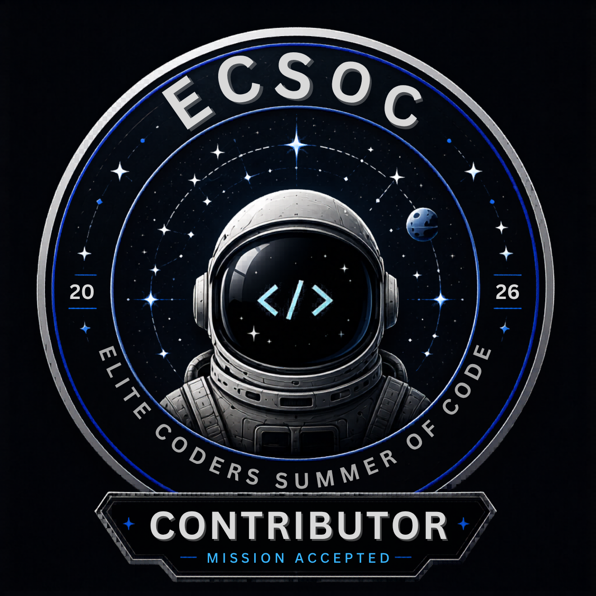
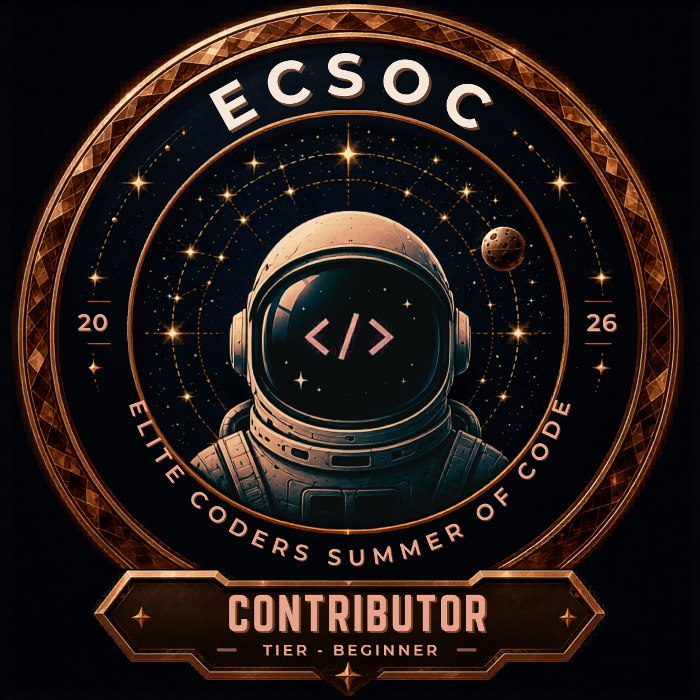
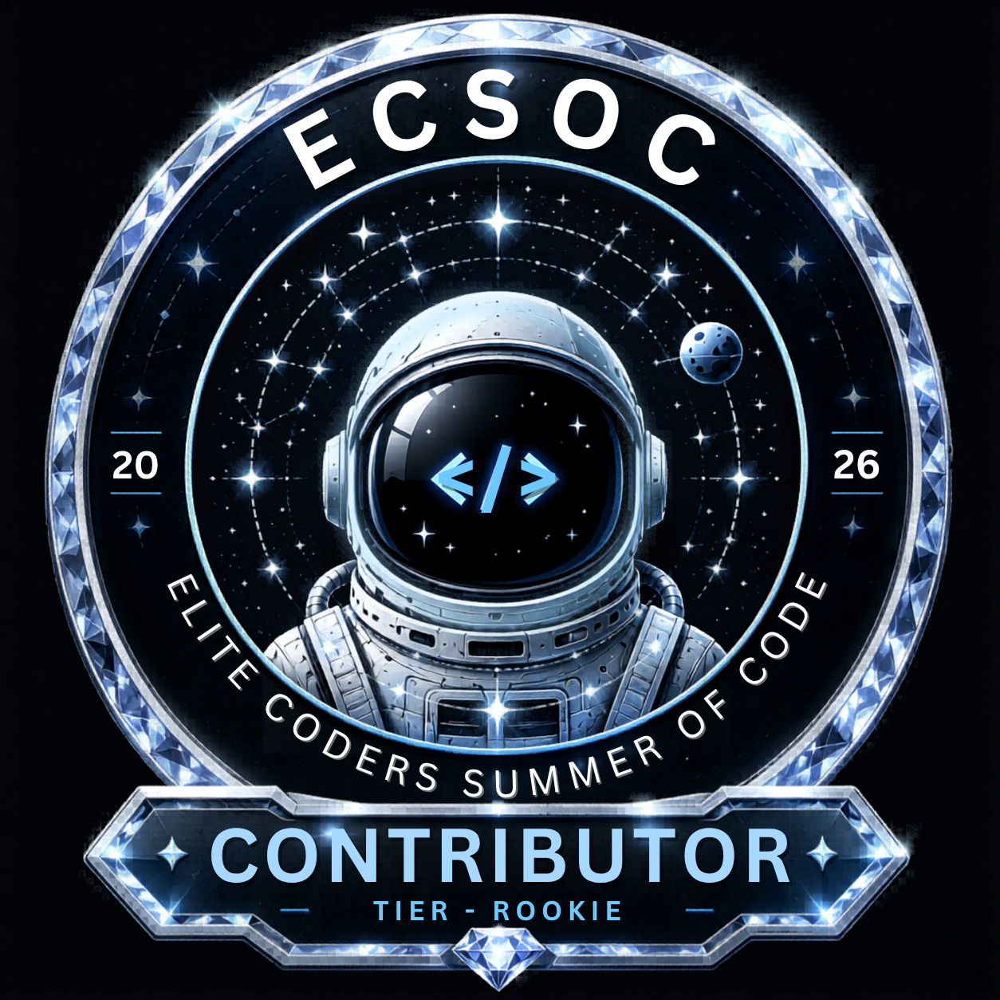

<h1 align="center">Hey 👋, I'm Krishna Kumar</h1>

  

---

# 👨‍💻 About Me

- 🎓 **B.Tech in Computer Science & Engineering** ('28) | **GPA: 8.41**
- 💻 **Full-Stack Developer** focused on building and shipping practical, production-ready software
- 🌐 **Active Open-Source Contributor** with core contributions to [memoriLabs/memori](https://github.com/memoriLabs/memori)
- 🏆 **ECSoC 2026 Contributor** (Elite Coders Summer of Code)
- ⚙️ Interested in **AI-powered applications**, **backend engineering**, and **scalable systems**
- 📫 Reach me at: **[krishnakumar2811004@gmail.com](mailto:krishnakumar2811004@gmail.com)**

---

# 🌐 Open Source Contributions

### 🧠 [Memori](https://github.com/memoriLabs/memori)
Contributed to core LLM memory pipelines by enhancing ingestion serialization safety and expanding unit test suites across retrieval and formatting workflows.

### 🏅 ECSoC 2026 / ECSoC Badges
Contributed to open-source partner projects during ECSoC 2026, progressing across four milestone tiers:

| Mission Accepted | Tier Beginner | Tier Rookie | Tier Hustler |
| :---: | :---: | :---: | :---: |
|  |  |  |  |

---

# 🚀 Featured Projects

### 🎨 Artfolio
Full-stack digital art platform featuring an interactive 3D virtual gallery and secure commission workflows with Razorpay integration.  
**Stack:** Next.js · Supabase · MySQL · Razorpay · Three.js · REST APIs

### 🧠 QuerySense
AI-powered SQL intelligence platform that detects structural database bottlenecks, evaluates performance risks, and recommends targeted optimizations using Google Gemini.  
**Stack:** Next.js · TypeScript · Prisma · Google Gemini

### 🏃 Territory Runner
Gamified GPS-based Android running application where users capture and defend real-world territory through location tracking and map-based area control.  
**Stack:** Kotlin · Android · OSMDroid · Room · DataStore · MVVM

---

# 🛠️ Tech Stack

  
  
  
  
  
  
  
  
  
  
  
  
  
  
  
  
  

---

# 📊 GitHub Activity

  

---

# 🌐 Connect With Me

  
  
  

---

  <i>"Build projects that people actually remember."</i>

